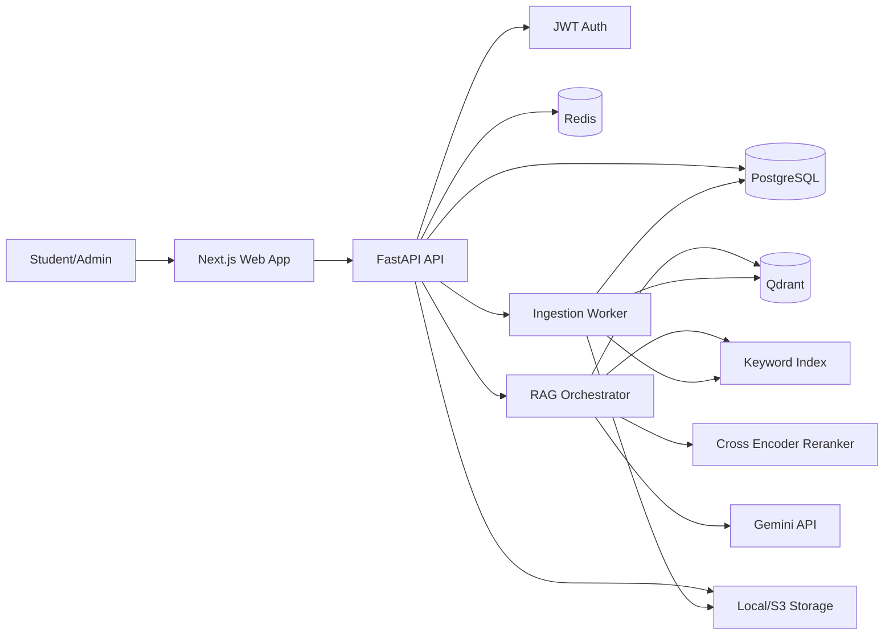
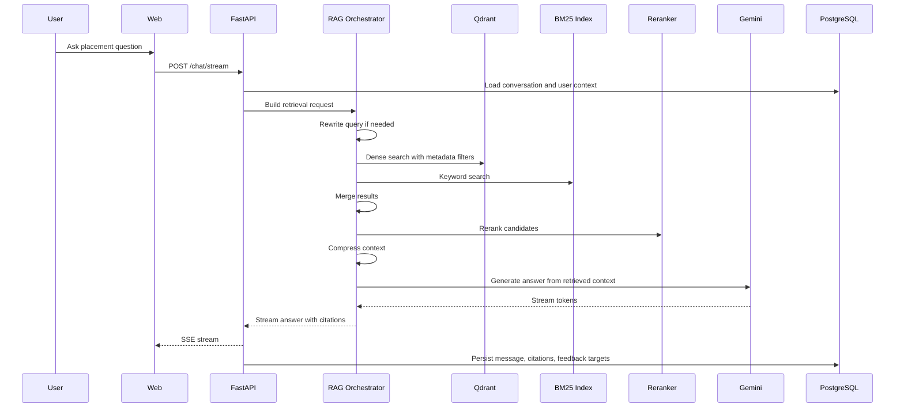
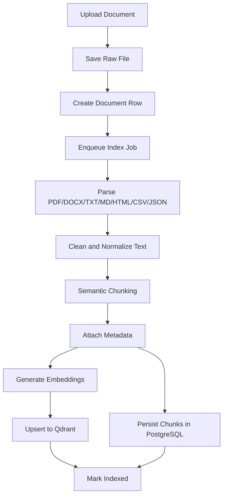

# Architecture

## Goal

Build an AI placement preparation platform that uses retrieval-augmented generation rather than free-form model answers. The assistant should answer from indexed knowledge whenever possible, show citations, support metadata filtering, and provide production-grade APIs for chat, resume review, company preparation, study plans, mock interviews, and admin workflows.

## High-Level Architecture

## Main Components

### Frontend

Next.js provides server-rendered pages, typed React components, responsive UI, and Vercel-friendly deployment. The UI is planned around a Notion + Perplexity + ChatGPT style: searchable workspace, citation-first answers, document management, progress surfaces, and modern dark mode.

### Backend API

FastAPI is responsible for authentication, API orchestration, validation, streaming responses, admin workflows, and coordinating RAG services. It should not directly contain all RAG logic; retrieval and indexing live in `packages/rag`.

### PostgreSQL

PostgreSQL stores users, roles, documents, chunks, conversations, messages, feedback, resume reports, company data, study plans, mock interviews, and analytics events. Qdrant stores embeddings, but PostgreSQL remains the source of truth for metadata and business entities.

### Qdrant

Qdrant stores chunk vectors with payload fields for metadata filtering. It supports company/topic/difficulty/source filters and scalable vector search.

### Redis

Redis is used for rate limiting, request-level caching, session-adjacent ephemeral state, streaming coordination, and background job queues.

### RAG Package

The RAG package owns ingestion, chunking, embeddings, retrieval, reranking, context compression, prompt construction, answer generation, citations, and evaluation hooks.

### Ingestion Worker

Document parsing and indexing can be expensive. Running it in a worker prevents uploads from blocking API requests and gives us retryable failed indexing logs.

## Why This Design

This design separates business APIs from AI retrieval internals. That matters because production RAG systems change frequently: chunking, embedding model versions, reranking thresholds, and prompt templates will evolve faster than auth or dashboard APIs.

The architecture also keeps the assistant from becoming a simple PDF chatbot. It supports structured metadata, company-wise filters, admin re-indexing, document versioning, analytics, and evaluation.

## Alternatives

### Single FastAPI App With All Logic

Simpler at the start, but retrieval, ingestion, admin, and chat orchestration become tightly coupled. This usually slows down iteration once hybrid search, reranking, streaming, and evaluations are added.

### Microservices From Day One

Clean service boundaries, but too much deployment and observability overhead for an early portfolio project. A modular monorepo gives most of the benefits without premature operational complexity.

### Managed Vector Search Inside PostgreSQL

`pgvector` would reduce infrastructure. Qdrant is chosen because the requested stack includes Qdrant and because payload indexing, vector search tuning, and collection management are central to showcasing AI engineering.

### LlamaIndex Only

LlamaIndex is strong for indexing and retrieval abstractions. LangGraph is better for explicit multi-step orchestration. Using both lets us keep ingestion/retrieval ergonomic while making chat flows observable and controllable.

## Trade-Offs

- More directories and boundaries than a toy app, but easier to scale feature ownership.
- Local Docker Compose adds setup work, but mirrors production dependencies.
- Async ingestion adds complexity, but avoids request timeouts and enables retry logs.
- Qdrant plus PostgreSQL duplicates some metadata, but Qdrant payloads are optimized for retrieval filters while PostgreSQL remains the authoritative relational store.
- Strict citation-first answering may refuse more often, but improves trust and protects against unsupported model hallucination.

## RAG Request Flow

## Ingestion Flow

## Core Non-Functional Requirements

- Streaming latency should begin within a few seconds for cached/retrievable queries.
- Retrieval must expose confidence and citation provenance.
- Upload/indexing must be retryable and observable.
- APIs must validate inputs with Pydantic.
- Secrets must never be committed.
- Prompt injection defenses must be applied before LLM generation.
- Role-based admin actions must be enforced server-side.

