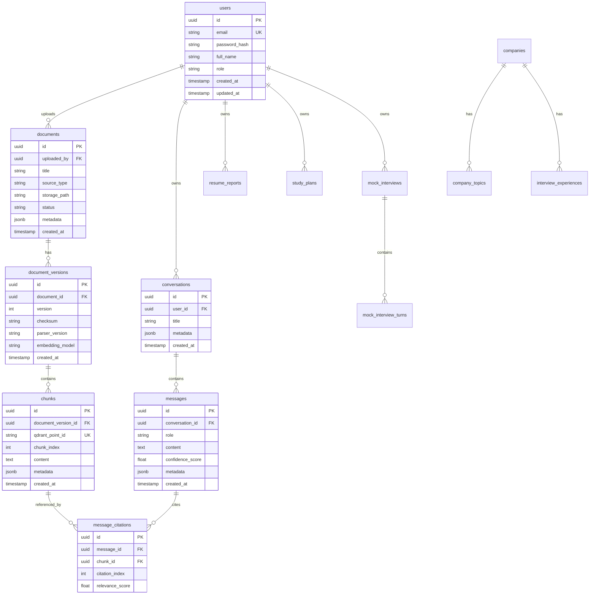

# Database Design

## PostgreSQL Source of Truth

PostgreSQL stores application state, user data, document metadata, chunk metadata, conversations, analytics, and evaluation records.

The implemented Module 2 schema lives in `apps/api/src/placement_api/models` with Alembic migrations in `apps/api/migrations`.

Note: PostgreSQL columns named `metadata` are exposed in SQLAlchemy models as `metadata_` because `metadata` is reserved by SQLAlchemy's Declarative API. The database column name still remains `metadata`.

## Initial Entity Relationship Diagram

## Important Indexes

- `users.email` unique index
- `documents.uploaded_by`
- `documents.status`
- `documents.metadata` GIN index
- `chunks.document_version_id`
- `chunks.qdrant_point_id` unique index
- `chunks.metadata` GIN index
- `conversations.user_id`
- `messages.conversation_id`
- `message_citations.message_id`
- `message_citations.chunk_id`

## Qdrant Collection Design

Collection: `placement_chunks_v1`

Vector:

- Size: depends on `BAAI/bge-large-en-v1.5`
- Distance: cosine

Payload fields:

- `chunk_id`
- `document_id`
- `document_version_id`
- `title`
- `topic`
- `difficulty`
- `company`
- `tags`
- `source`
- `upload_date`
- `author`
- `content_hash`
- `embedding_model`

Payload indexes:

- `topic`
- `difficulty`
- `company`
- `tags`
- `source`
- `upload_date`
- `author`

## Why Duplicate Metadata in PostgreSQL and Qdrant

PostgreSQL remains authoritative and supports relational workflows. Qdrant payloads enable fast vector search filtering without joining back to PostgreSQL during candidate retrieval.
